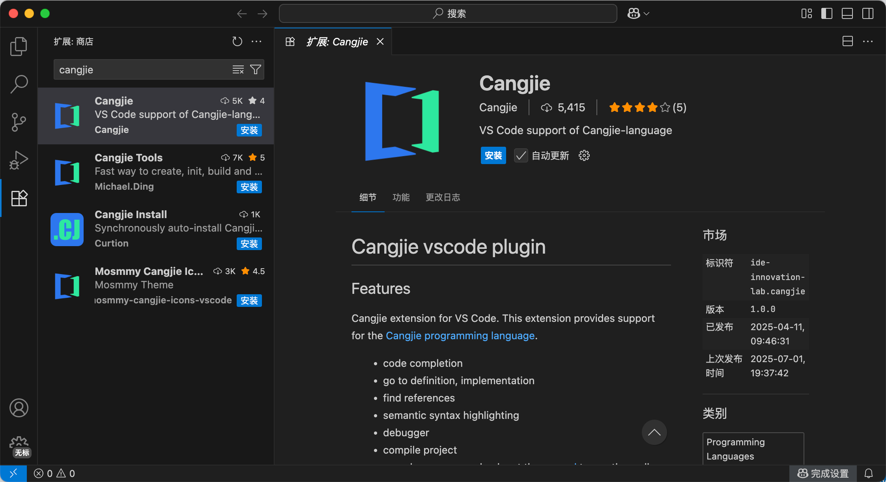

目前（2025 年 8 月）编写仓颉代码推荐的编辑器为 [Visual Studio Code](https://code.visualstudio.com)。

Visual Studio Code（下面简称 `VSCode`）是由微软在 2015 年推出的轻量级的文本编辑器，其支持多种编程语言，并且支持插件化。

目前，仓颉语言官方提供了 VSCode 的插件，可以装在编辑器上，以便于获取语法高亮、代码补全等功能。

## 安装仓颉的 VSCode 插件

在 VSCode 左侧扩展选项卡中，搜索 `Cangjie`，可以看到由 Cangjie 团队提供的 [`Cangjie` 插件](https://marketplace.visualstudio.com/items?itemName=IDE-Innovation-Lab.cangjie)。点击安装即可。

